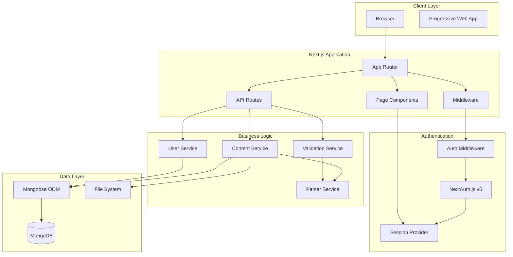
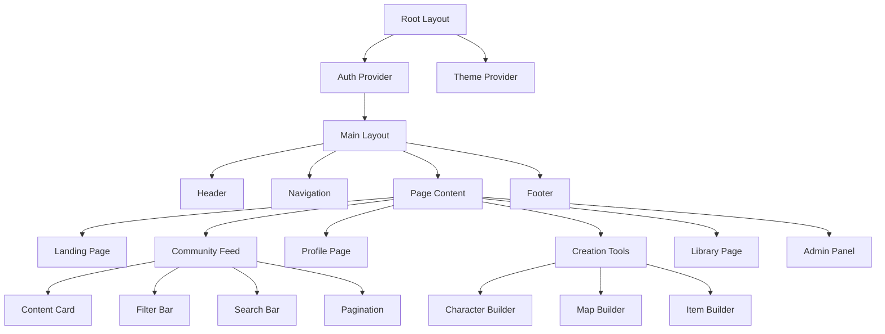
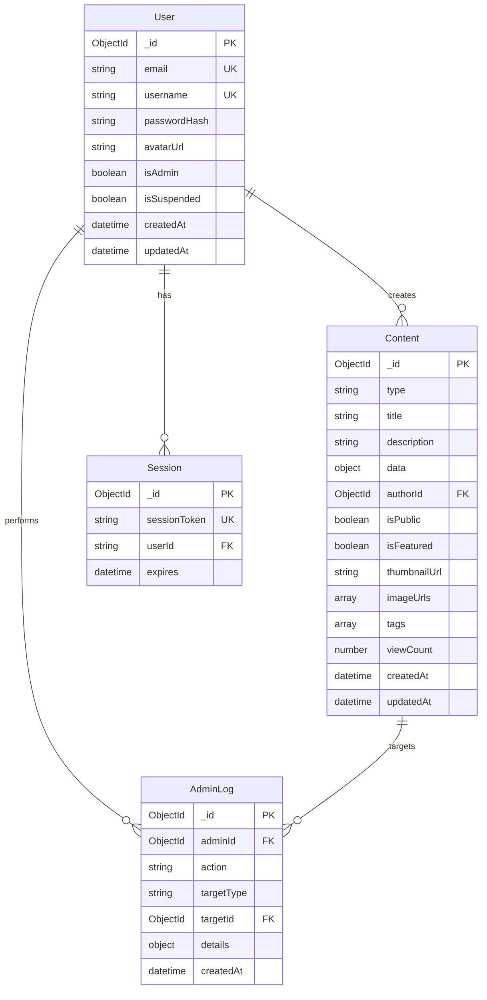

# Design Document: GM Secret House Platform

## Overview

The GM Secret House platform is a full-stack web application built with Next.js 14+ that provides D&D players and Game Masters with content creation tools, a knowledge base, and community features. The system follows a modular architecture designed for future expansion into marketplace, subscription, and MMORPG features.

### Core Design Principles

1. **Modular Architecture**: Clear separation between authentication, content management, creation tools, and community features
2. **Type Safety**: End-to-end TypeScript with Zod schema validation
3. **Performance First**: Code splitting, lazy loading, optimized assets, and efficient database queries
4. **Security by Default**: Input sanitization, CSRF protection, rate limiting, and secure session management
5. **Scalability**: Indexed database queries, pagination, and caching strategies for 10,000+ content items
6. **Responsive Design**: Mobile-first approach supporting 320px to 3840px viewports

### Technology Stack

- **Frontend**: Next.js 14+ (App Router), React 18+, TypeScript 5+
- **Styling**: TailwindCSS 3+ with shadcn/ui component library
- **Animations**: Framer Motion for transitions and interactive elements
- **State Management**: Zustand for global state, React Context for feature-specific state
- **Forms**: React Hook Form with Zod validation
- **Backend**: Next.js API Routes (serverless functions)
- **Authentication**: NextAuth.js v5 with credential provider
- **Database**: MongoDB 6+ with Mongoose ODM
- **File Storage**: Local filesystem (development), future cloud storage integration
- **Deployment**: Vercel with automatic GitHub integration

## Architecture

### System Architecture Diagram



### Application Structure

```
gm-secret-house/
├── src/
│   ├── app/                          # Next.js App Router
│   │   ├── (auth)/                   # Auth route group
│   │   │   ├── login/
│   │   │   └── register/
│   │   ├── (main)/                   # Main app route group
│   │   │   ├── community/
│   │   │   ├── library/
│   │   │   ├── profile/[username]/
│   │   │   └── tools/
│   │   │       ├── characters/
│   │   │       ├── maps/
│   │   │       └── items/
│   │   ├── admin/
│   │   ├── api/                      # API Routes
│   │   │   ├── auth/[...nextauth]/
│   │   │   ├── content/
│   │   │   ├── users/
│   │   │   └── upload/
│   │   ├── layout.tsx
│   │   └── page.tsx                  # Landing page
│   ├── components/                   # React components
│   │   ├── ui/                       # shadcn/ui components
│   │   ├── auth/
│   │   ├── content/
│   │   ├── tools/
│   │   └── layout/
│   ├── lib/                          # Business logic
│   │   ├── services/
│   │   │   ├── content.service.ts
│   │   │   ├── user.service.ts
│   │   │   ├── validation.service.ts
│   │   │   └── parser.service.ts
│   │   ├── db/
│   │   │   ├── mongoose.ts
│   │   │   └── models/
│   │   │       ├── User.ts
│   │   │       ├── Content.ts
│   │   │       └── Session.ts
│   │   ├── schemas/                  # Zod validation schemas
│   │   │   ├── auth.schema.ts
│   │   │   ├── content.schema.ts
│   │   │   └── character.schema.ts
│   │   ├── utils/
│   │   └── constants/
│   ├── hooks/                        # Custom React hooks
│   ├── stores/                       # Zustand stores
│   ├── types/                        # TypeScript types
│   └── middleware.ts                 # Next.js middleware
├── public/
│   ├── uploads/                      # User-uploaded assets
│   ├── media/                        # Static media
│   └── fonts/                        # Custom fonts
└── prisma/ or migrations/            # Database migrations
```

## Components and Interfaces

### Core Component Hierarchy



### Key Component Interfaces

#### Authentication Components

```typescript
// LoginForm Component
interface LoginFormProps {
  onSuccess?: (user: User) => void;
  redirectTo?: string;
}

interface LoginFormData {
  email: string;
  password: string;
}

// RegisterForm Component
interface RegisterFormProps {
  onSuccess?: (user: User) => void;
  redirectTo?: string;
}

interface RegisterFormData {
  email: string;
  username: string;
  password: string;
  confirmPassword: string;
}

// AuthGuard Component
interface AuthGuardProps {
  children: React.ReactNode;
  requireAuth?: boolean;
  requireAdmin?: boolean;
  fallback?: React.ReactNode;
}
```

#### Content Components

```typescript
// ContentCard Component
interface ContentCardProps {
  content: ContentItem;
  showAuthor?: boolean;
  onClick?: (content: ContentItem) => void;
  actions?: ContentAction[];
}

interface ContentItem {
  id: string;
  type: ContentType;
  title: string;
  description: string;
  data: Record<string, any>;
  authorId: string;
  authorUsername: string;
  isPublic: boolean;
  isFeatured: boolean;
  thumbnailUrl?: string;
  createdAt: Date;
  updatedAt: Date;
}

type ContentType =
  | "character"
  | "map"
  | "item"
  | "spell"
  | "artifact"
  | "creature";

interface ContentAction {
  label: string;
  icon: React.ReactNode;
  onClick: (content: ContentItem) => void;
  variant?: "default" | "destructive";
}

// CommunityFeed Component
interface CommunityFeedProps {
  initialFilter?: ContentType | "all";
  pageSize?: number;
}

interface FeedFilters {
  type: ContentType | "all";
  searchQuery: string;
  sortBy: "createdAt" | "updatedAt";
  sortOrder: "asc" | "desc";
}

// ContentDetailView Component
interface ContentDetailViewProps {
  contentId: string;
  onEdit?: () => void;
  onDelete?: () => void;
}
```

#### Creation Tool Components

```typescript
// CharacterBuilder Component
interface CharacterBuilderProps {
  characterId?: string;
  onSave?: (character: CharacterData) => void;
  onCancel?: () => void;
}

interface CharacterData {
  name: string;
  race: string;
  class: string;
  level: number;
  abilityScores: AbilityScores;
  skills: Skill[];
  equipment: EquipmentItem[];
  spells: Spell[];
  background: string;
  appearance: {
    description: string;
    portraitUrl?: string;
  };
}

interface AbilityScores {
  strength: number;
  dexterity: number;
  constitution: number;
  intelligence: number;
  wisdom: number;
  charisma: number;
}

// MapBuilder Component
interface MapBuilderProps {
  mapId?: string;
  onSave?: (map: MapData) => void;
  onCancel?: () => void;
}

interface MapData {
  name: string;
  gridSize: { width: number; height: number };
  cells: MapCell[];
  markers: MapMarker[];
}

interface MapCell {
  x: number;
  y: number;
  terrain: TerrainType;
  customProperties?: Record<string, any>;
}

type TerrainType =
  | "floor"
  | "wall"
  | "door"
  | "water"
  | "difficult_terrain"
  | "custom";

interface MapMarker {
  id: string;
  x: number;
  y: number;
  label: string;
  icon: string;
  color: string;
}

// ItemBuilder Component
interface ItemBuilderProps {
  itemId?: string;
  onSave?: (item: ItemData) => void;
  onCancel?: () => void;
}

interface ItemData {
  name: string;
  type: ItemType;
  rarity: RarityLevel;
  description: string;
  properties: string[];
  weight: number;
  cost: number;
  magicalEffects?: string;
  imageUrl?: string;
}

type ItemType =
  | "weapon"
  | "armor"
  | "potion"
  | "scroll"
  | "wondrous_item"
  | "tool"
  | "treasure";
type RarityLevel =
  | "common"
  | "uncommon"
  | "rare"
  | "very_rare"
  | "legendary"
  | "artifact";
```

#### Layout Components

```typescript
// Header Component
interface HeaderProps {
  user?: User | null;
  onLogout?: () => void;
}

// Navigation Component
interface NavigationProps {
  currentPath: string;
  user?: User | null;
}

interface NavItem {
  label: string;
  href: string;
  icon?: React.ReactNode;
  requireAuth?: boolean;
  requireAdmin?: boolean;
}

// HeroSection Component
interface HeroSectionProps {
  videoUrl: string;
  title: string;
  subtitle: string;
  ctaButtons: CTAButton[];
}

interface CTAButton {
  label: string;
  href: string;
  variant: "primary" | "secondary";
}

// HeroesCarousel Component
interface HeroesCarouselProps {
  characters: ContentItem[];
  autoRotateInterval?: number;
}
```

### API Route Interfaces

```typescript
// Content API Routes
// POST /api/content
interface CreateContentRequest {
  type: ContentType;
  title: string;
  description: string;
  data: Record<string, any>;
  isPublic: boolean;
}

interface CreateContentResponse {
  success: boolean;
  content?: ContentItem;
  error?: string;
}

// GET /api/content
interface GetContentRequest {
  type?: ContentType | "all";
  authorId?: string;
  isPublic?: boolean;
  searchQuery?: string;
  page?: number;
  limit?: number;
}

interface GetContentResponse {
  success: boolean;
  content: ContentItem[];
  pagination: {
    page: number;
    limit: number;
    total: number;
    totalPages: number;
  };
  error?: string;
}

// PUT /api/content/[id]
interface UpdateContentRequest {
  title?: string;
  description?: string;
  data?: Record<string, any>;
  isPublic?: boolean;
  isFeatured?: boolean;
}

interface UpdateContentResponse {
  success: boolean;
  content?: ContentItem;
  error?: string;
}

// DELETE /api/content/[id]
interface DeleteContentResponse {
  success: boolean;
  error?: string;
}

// User API Routes
// POST /api/users/register
interface RegisterRequest {
  email: string;
  username: string;
  password: string;
}

interface RegisterResponse {
  success: boolean;
  user?: {
    id: string;
    email: string;
    username: string;
  };
  error?: string;
}

// GET /api/users/[username]
interface GetUserResponse {
  success: boolean;
  user?: {
    id: string;
    username: string;
    avatarUrl?: string;
    createdAt: Date;
  };
  error?: string;
}

// PUT /api/users/profile
interface UpdateProfileRequest {
  username?: string;
  avatarUrl?: string;
}

interface UpdateProfileResponse {
  success: boolean;
  user?: User;
  error?: string;
}

// Upload API Routes
// POST /api/upload
interface UploadRequest {
  file: File;
  type: "avatar" | "content" | "thumbnail";
}

interface UploadResponse {
  success: boolean;
  url?: string;
  thumbnailUrl?: string;
  error?: string;
}
```

## Data Models

### MongoDB Schema Definitions

#### User Model

```typescript
import mongoose, { Schema, Document } from "mongoose";

export interface IUser extends Document {
  email: string;
  username: string;
  passwordHash: string;
  avatarUrl?: string;
  isAdmin: boolean;
  isSuspended: boolean;
  createdAt: Date;
  updatedAt: Date;
}

const UserSchema = new Schema<IUser>(
  {
    email: {
      type: String,
      required: true,
      unique: true,
      lowercase: true,
      trim: true,
      index: true,
    },
    username: {
      type: String,
      required: true,
      unique: true,
      trim: true,
      minlength: 3,
      maxlength: 30,
      index: true,
    },
    passwordHash: {
      type: String,
      required: true,
    },
    avatarUrl: {
      type: String,
      default: null,
    },
    isAdmin: {
      type: Boolean,
      default: false,
    },
    isSuspended: {
      type: Boolean,
      default: false,
    },
  },
  {
    timestamps: true,
  }
);

// Indexes
UserSchema.index({ email: 1 });
UserSchema.index({ username: 1 });

export const User =
  mongoose.models.User || mongoose.model<IUser>("User", UserSchema);
```

#### Content Model

```typescript
import mongoose, { Schema, Document, Types } from "mongoose";

export interface IContent extends Document {
  type: ContentType;
  title: string;
  description: string;
  data: Record<string, any>;
  authorId: Types.ObjectId;
  isPublic: boolean;
  isFeatured: boolean;
  thumbnailUrl?: string;
  imageUrls: string[];
  tags: string[];
  viewCount: number;
  createdAt: Date;
  updatedAt: Date;
}

const ContentSchema = new Schema<IContent>(
  {
    type: {
      type: String,
      required: true,
      enum: ["character", "map", "item", "spell", "artifact", "creature"],
      index: true,
    },
    title: {
      type: String,
      required: true,
      trim: true,
      maxlength: 200,
    },
    description: {
      type: String,
      required: true,
      trim: true,
      maxlength: 2000,
    },
    data: {
      type: Schema.Types.Mixed,
      required: true,
    },
    authorId: {
      type: Schema.Types.ObjectId,
      ref: "User",
      required: true,
      index: true,
    },
    isPublic: {
      type: Boolean,
      default: false,
      index: true,
    },
    isFeatured: {
      type: Boolean,
      default: false,
      index: true,
    },
    thumbnailUrl: {
      type: String,
      default: null,
    },
    imageUrls: {
      type: [String],
      default: [],
    },
    tags: {
      type: [String],
      default: [],
      index: true,
    },
    viewCount: {
      type: Number,
      default: 0,
    },
  },
  {
    timestamps: true,
  }
);

// Compound Indexes
ContentSchema.index({ authorId: 1, isPublic: 1 });
ContentSchema.index({ type: 1, isPublic: 1 });
ContentSchema.index({ createdAt: -1 });
ContentSchema.index({ isFeatured: 1, type: 1 });

// Text Index for Search
ContentSchema.index({ title: "text", description: "text", tags: "text" });

export const Content =
  mongoose.models.Content || mongoose.model<IContent>("Content", ContentSchema);
```

#### Session Model (NextAuth.js)

```typescript
import mongoose, { Schema, Document } from "mongoose";

export interface ISession extends Document {
  sessionToken: string;
  userId: string;
  expires: Date;
}

const SessionSchema = new Schema<ISession>({
  sessionToken: {
    type: String,
    required: true,
    unique: true,
    index: true,
  },
  userId: {
    type: String,
    required: true,
    index: true,
  },
  expires: {
    type: Date,
    required: true,
    index: true,
  },
});

// TTL Index for automatic session cleanup
SessionSchema.index({ expires: 1 }, { expireAfterSeconds: 0 });

export const Session =
  mongoose.models.Session || mongoose.model<ISession>("Session", SessionSchema);
```

#### AdminLog Model

```typescript
import mongoose, { Schema, Document, Types } from "mongoose";

export interface IAdminLog extends Document {
  adminId: Types.ObjectId;
  action: string;
  targetType: "user" | "content";
  targetId: Types.ObjectId;
  details: Record<string, any>;
  createdAt: Date;
}

const AdminLogSchema = new Schema<IAdminLog>(
  {
    adminId: {
      type: Schema.Types.ObjectId,
      ref: "User",
      required: true,
      index: true,
    },
    action: {
      type: String,
      required: true,
      enum: [
        "suspend_user",
        "delete_user",
        "modify_role",
        "delete_content",
        "feature_content",
        "unfeature_content",
      ],
    },
    targetType: {
      type: String,
      required: true,
      enum: ["user", "content"],
    },
    targetId: {
      type: Schema.Types.ObjectId,
      required: true,
    },
    details: {
      type: Schema.Types.Mixed,
      default: {},
    },
  },
  {
    timestamps: { createdAt: true, updatedAt: false },
  }
);

AdminLogSchema.index({ adminId: 1, createdAt: -1 });
AdminLogSchema.index({ targetType: 1, targetId: 1 });

export const AdminLog =
  mongoose.models.AdminLog ||
  mongoose.model<IAdminLog>("AdminLog", AdminLogSchema);
```

### Database Relationships



## Correctness Properties

_A property is a characteristic or behavior that should hold true across all valid executions of a system—essentially, a formal statement about what the system should do. Properties serve as the bridge between human-readable specifications and machine-verifiable correctness guarantees._

The GM Secret House platform includes several pure functions and data transformations that are well-suited for property-based testing. The following properties capture universal behaviors that must hold across all valid inputs.

### Property 1: User Registration Data Round-Trip

_For any_ valid user registration data (email, username), validating the data, storing it in the database, and retrieving it SHALL produce equivalent email and username values.

**Validates: Requirements 1.8**

This property ensures data integrity in the user registration pipeline. The validation, storage, and retrieval operations must preserve the exact values provided by the user.

### Property 2: Content Serialization Round-Trip

_For any_ valid Content_Item of any Content_Type, serializing the item to JSON and then deserializing it back SHALL produce an equivalent Content_Item with identical field values.

**Validates: Requirements 3.9**

This property ensures that content data can be reliably persisted and retrieved from the database without data loss or corruption. All content types (character, map, item, spell, artifact, creature) must maintain their structure through the serialization cycle.

### Property 3: Ability Modifier Calculation Invariant

_For any_ ability score value between 1 and 30 (inclusive), the calculated ability modifier SHALL equal floor((ability_score - 10) / 2).

**Validates: Requirements 4.10**

This property ensures the D&D 5e ability modifier calculation is correctly implemented. The formula must hold for all valid ability scores, including edge cases (1, 10, 11, 30).

### Property 4: Map Coordinate Bounds Invariant

_For any_ valid map with grid size (width, height), all cell coordinates in the map SHALL satisfy: 0 ≤ x < width AND 0 ≤ y < height.

**Validates: Requirements 5.9**

This property ensures spatial integrity of map data. No cell can exist outside the defined grid boundaries, preventing rendering errors and data corruption.

### Property 5: Pagination Count Invariant

_For any_ pagination operation on Public_Content with page size N and page number P, the total number of items displayed across all pages SHALL be less than or equal to the total count of Public_Content items.

**Validates: Requirements 7.9**

This property ensures pagination logic never displays more items than exist in the database. It prevents duplicate items across pages and maintains data consistency in the community feed.

### Property 6: Schema Validation Completeness

_For any_ Content_Item that passes schema validation for its Content_Type, the validated data SHALL contain defined values for all required fields specified in the Content_Schema.

**Validates: Requirements 15.8**

This property ensures the validation layer correctly enforces required fields. After validation succeeds, no required field should be undefined or missing.

### Property 7: Carousel Index Bounds Invariant

_For any_ Heroes_Carousel state with N featured items, the current display index SHALL satisfy: 0 ≤ index < N for all navigation operations (next, previous, auto-rotate).

**Validates: Requirements 17.8**

This property ensures carousel navigation never attempts to display an out-of-bounds index, preventing runtime errors and undefined behavior.

### Property 8: Parser/Pretty-Printer Round-Trip

_For any_ valid typed content object, pretty-printing it to JSON, parsing the JSON back to a typed object, and pretty-printing again SHALL produce identical JSON output.

**Validates: Requirements 20.5**

This property ensures the Parser and Pretty_Printer are true inverses of each other. The round-trip operation must be idempotent, preserving data structure and values through multiple transformations.

## Error Handling

### Error Handling Strategy

The platform implements a layered error handling approach with consistent error responses, user-friendly messages, and comprehensive logging.

#### Error Categories

1. **Validation Errors (400 Bad Request)**
   - Invalid input data (malformed email, short username, invalid content schema)
   - File upload violations (size, type, format)
   - Business rule violations (duplicate username, invalid ability scores)

2. **Authentication Errors (401 Unauthorized)**
   - Invalid credentials
   - Expired session
   - Missing authentication token

3. **Authorization Errors (403 Forbidden)**
   - Insufficient permissions (non-admin accessing admin panel)
   - Attempting to modify another user's content
   - Accessing private content without ownership

4. **Not Found Errors (404 Not Found)**
   - Requested resource doesn't exist
   - Invalid content ID
   - User profile not found

5. **Rate Limiting Errors (429 Too Many Requests)**
   - Exceeded 100 requests per minute per IP
   - Temporary cooldown required

6. **Server Errors (500 Internal Server Error)**
   - Database connection failures
   - Unexpected exceptions
   - Third-party service failures

### Error Response Format

All API routes return errors in a consistent JSON format:

```typescript
interface ErrorResponse {
  error: string; // Human-readable error message
  code: string; // Machine-readable error code
  details?: any; // Optional validation details or field errors
  timestamp: string; // ISO 8601 timestamp
  requestId?: string; // Optional request tracking ID
}
```

**Example Error Responses:**

```json
// Validation Error
{
  "error": "Validation failed",
  "code": "VALIDATION_ERROR",
  "details": {
    "username": "Username must be at least 3 characters",
    "email": "Invalid email format"
  },
  "timestamp": "2024-01-15T10:30:00.000Z"
}

// Authentication Error
{
  "error": "Invalid credentials",
  "code": "AUTH_INVALID_CREDENTIALS",
  "timestamp": "2024-01-15T10:30:00.000Z"
}

// Authorization Error
{
  "error": "Access denied",
  "code": "AUTH_FORBIDDEN",
  "details": "Admin privileges required",
  "timestamp": "2024-01-15T10:30:00.000Z"
}

// Rate Limiting Error
{
  "error": "Too many requests",
  "code": "RATE_LIMIT_EXCEEDED",
  "details": "Retry after 60 seconds",
  "timestamp": "2024-01-15T10:30:00.000Z"
}
```

### Error Handling Implementation

#### API Route Error Handler

```typescript
// lib/utils/errorHandler.ts
export class AppError extends Error {
  constructor(
    public statusCode: number,
    public code: string,
    message: string,
    public details?: any
  ) {
    super(message);
    this.name = "AppError";
  }
}

export function handleApiError(error: unknown): Response {
  // Log error for monitoring
  console.error("[API Error]", error);

  if (error instanceof AppError) {
    return Response.json(
      {
        error: error.message,
        code: error.code,
        details: error.details,
        timestamp: new Date().toISOString(),
      },
      { status: error.statusCode }
    );
  }

  if (error instanceof ZodError) {
    return Response.json(
      {
        error: "Validation failed",
        code: "VALIDATION_ERROR",
        details: error.flatten().fieldErrors,
        timestamp: new Date().toISOString(),
      },
      { status: 400 }
    );
  }

  // Generic server error (don't expose internal details)
  return Response.json(
    {
      error: "Internal server error",
      code: "INTERNAL_ERROR",
      timestamp: new Date().toISOString(),
    },
    { status: 500 }
  );
}
```

#### Frontend Error Handling

```typescript
// lib/utils/apiClient.ts
export async function apiRequest<T>(
  url: string,
  options?: RequestInit
): Promise<T> {
  try {
    const response = await fetch(url, {
      ...options,
      headers: {
        "Content-Type": "application/json",
        ...options?.headers,
      },
    });

    const data = await response.json();

    if (!response.ok) {
      throw new ApiError(
        response.status,
        data.code || "UNKNOWN_ERROR",
        data.error || "An error occurred",
        data.details
      );
    }

    return data;
  } catch (error) {
    if (error instanceof ApiError) {
      throw error;
    }
    // Network error or JSON parse error
    throw new ApiError(0, "NETWORK_ERROR", "Network request failed");
  }
}

export class ApiError extends Error {
  constructor(
    public statusCode: number,
    public code: string,
    message: string,
    public details?: any
  ) {
    super(message);
    this.name = "ApiError";
  }
}
```

#### Component Error Boundaries

```typescript
// components/ErrorBoundary.tsx
'use client';

import { Component, ReactNode } from 'react';

interface Props {
  children: ReactNode;
  fallback?: ReactNode;
}

interface State {
  hasError: boolean;
  error?: Error;
}

export class ErrorBoundary extends Component<Props, State> {
  constructor(props: Props) {
    super(props);
    this.state = { hasError: false };
  }

  static getDerivedStateFromError(error: Error): State {
    return { hasError: true, error };
  }

  componentDidCatch(error: Error, errorInfo: any) {
    console.error('[Error Boundary]', error, errorInfo);
    // Send to error tracking service (e.g., Sentry)
  }

  render() {
    if (this.state.hasError) {
      return this.props.fallback || (
        <div className="error-container">
          <h2>Что-то пошло не так</h2>
          <p>Пожалуйста, обновите страницу или попробуйте позже.</p>
        </div>
      );
    }

    return this.props.children;
  }
}
```

### Error Logging and Monitoring

#### Development Environment

- Console logging with full error details and stack traces
- Detailed validation error messages
- Database query logging

#### Production Environment

- Structured logging to external service (e.g., Vercel logs, Sentry)
- Error aggregation and alerting
- Performance monitoring
- User-friendly error messages (no stack traces or internal details)

```typescript
// lib/utils/logger.ts
export const logger = {
  error: (message: string, error: unknown, context?: Record<string, any>) => {
    const errorData = {
      message,
      error:
        error instanceof Error
          ? {
              name: error.name,
              message: error.message,
              stack:
                process.env.NODE_ENV === "development"
                  ? error.stack
                  : undefined,
            }
          : error,
      context,
      timestamp: new Date().toISOString(),
      environment: process.env.NODE_ENV,
    };

    console.error("[ERROR]", JSON.stringify(errorData, null, 2));

    // Send to external monitoring service in production
    if (process.env.NODE_ENV === "production") {
      // Sentry.captureException(error, { extra: context });
    }
  },

  warn: (message: string, context?: Record<string, any>) => {
    console.warn("[WARN]", message, context);
  },

  info: (message: string, context?: Record<string, any>) => {
    console.info("[INFO]", message, context);
  },
};
```

### Specific Error Scenarios

#### File Upload Errors

```typescript
// Validation errors for file uploads
export function validateFileUpload(file: File): void {
  const allowedTypes = ["image/jpeg", "image/png", "image/webp", "image/gif"];
  const maxSize = 10 * 1024 * 1024; // 10MB

  if (!allowedTypes.includes(file.type)) {
    throw new AppError(400, "INVALID_FILE_TYPE", "Invalid file type", {
      allowedTypes,
      receivedType: file.type,
    });
  }

  if (file.size > maxSize) {
    throw new AppError(
      400,
      "FILE_TOO_LARGE",
      "File size exceeds maximum allowed",
      { maxSize, receivedSize: file.size }
    );
  }
}
```

#### Database Connection Errors

```typescript
// Database connection error handling
export async function connectToDatabase() {
  try {
    if (mongoose.connection.readyState === 1) {
      return mongoose.connection;
    }

    await mongoose.connect(process.env.MONGODB_URI!);
    return mongoose.connection;
  } catch (error) {
    logger.error("Database connection failed", error);
    throw new AppError(
      500,
      "DATABASE_CONNECTION_ERROR",
      "Unable to connect to database"
    );
  }
}
```

#### Authentication Errors

```typescript
// Authentication error handling
export async function requireAuth(request: Request): Promise<Session> {
  const session = await getServerSession(authOptions);

  if (!session || !session.user) {
    throw new AppError(401, "AUTH_REQUIRED", "Authentication required");
  }

  return session;
}

export async function requireAdmin(request: Request): Promise<Session> {
  const session = await requireAuth(request);

  const user = await User.findById(session.user.id);
  if (!user?.isAdmin) {
    throw new AppError(403, "AUTH_ADMIN_REQUIRED", "Admin privileges required");
  }

  return session;
}
```

#### Content Validation Errors

```typescript
// Content schema validation with detailed errors
export function validateContent(type: ContentType, data: any) {
  const schema = getContentSchema(type);

  try {
    return schema.parse(data);
  } catch (error) {
    if (error instanceof ZodError) {
      throw new AppError(
        400,
        "CONTENT_VALIDATION_ERROR",
        "Content validation failed",
        error.flatten().fieldErrors
      );
    }
    throw error;
  }
}
```

### User-Facing Error Messages (Russian)

```typescript
// lib/constants/errorMessages.ts
export const ERROR_MESSAGES_RU: Record<string, string> = {
  // Authentication
  AUTH_INVALID_CREDENTIALS: "Неверный email или пароль",
  AUTH_REQUIRED: "Требуется авторизация",
  AUTH_ADMIN_REQUIRED: "Требуются права администратора",

  // Validation
  VALIDATION_ERROR: "Ошибка валидации данных",
  INVALID_FILE_TYPE: "Недопустимый тип файла",
  FILE_TOO_LARGE: "Файл слишком большой",

  // Content
  CONTENT_NOT_FOUND: "Контент не найден",
  CONTENT_VALIDATION_ERROR: "Ошибка валидации контента",

  // User
  USER_NOT_FOUND: "Пользователь не найден",
  USERNAME_TAKEN: "Имя пользователя уже занято",
  EMAIL_TAKEN: "Email уже зарегистрирован",

  // Rate limiting
  RATE_LIMIT_EXCEEDED: "Слишком много запросов. Попробуйте позже",

  // Generic
  INTERNAL_ERROR: "Внутренняя ошибка сервера",
  NETWORK_ERROR: "Ошибка сети. Проверьте подключение",
};
```

## Testing Strategy

### Overview

The GM Secret House platform employs a comprehensive testing strategy combining property-based testing for pure functions, example-based unit tests for components, integration tests for API routes, and end-to-end tests for critical user flows.

### Testing Pyramid

```
                    /\
                   /  \
                  / E2E \
                 /--------\
                /          \
               / Integration \
              /--------------\
             /                \
            /   Unit + Property \
           /--------------------\
```

### Property-Based Testing

Property-based testing is used for pure functions and data transformations where universal properties can be verified across many generated inputs.

#### Property Testing Library

**Library**: `fast-check` (JavaScript/TypeScript property-based testing library)

**Installation**:

```bash
npm install --save-dev fast-check @types/fast-check
```

#### Property Test Configuration

- **Minimum iterations**: 100 runs per property test
- **Seed**: Configurable for reproducibility
- **Shrinking**: Enabled to find minimal failing examples
- **Timeout**: 10 seconds per property test

#### Property Test Implementation

Each correctness property from the design document must be implemented as a property-based test with a comment tag referencing the design property.

**Tag Format**: `// Feature: gm-secret-house-platform, Property {number}: {property_text}`

**Example Property Tests**:

```typescript
// tests/properties/content.property.test.ts
import fc from "fast-check";
import { describe, it, expect } from "vitest";
import {
  serializeContent,
  deserializeContent,
} from "@/lib/services/content.service";
import { contentArbitrary } from "./arbitraries/content.arbitrary";

describe("Content Serialization Properties", () => {
  it("Property 2: Content serialization round-trip preserves data", () => {
    // Feature: gm-secret-house-platform, Property 2: For any valid Content_Item, serializing to JSON then deserializing SHALL produce equivalent data

    fc.assert(
      fc.property(contentArbitrary, (content) => {
        const serialized = serializeContent(content);
        const deserialized = deserializeContent(serialized);

        expect(deserialized).toEqual(content);
      }),
      { numRuns: 100 }
    );
  });
});

// tests/properties/character.property.test.ts
import fc from "fast-check";
import { describe, it, expect } from "vitest";
import { calculateAbilityModifier } from "@/lib/utils/character";

describe("Character Calculation Properties", () => {
  it("Property 3: Ability modifier calculation invariant", () => {
    // Feature: gm-secret-house-platform, Property 3: For any ability score 1-30, modifier = floor((score - 10) / 2)

    fc.assert(
      fc.property(fc.integer({ min: 1, max: 30 }), (abilityScore) => {
        const modifier = calculateAbilityModifier(abilityScore);
        const expected = Math.floor((abilityScore - 10) / 2);

        expect(modifier).toBe(expected);
      }),
      { numRuns: 100 }
    );
  });
});

// tests/properties/map.property.test.ts
import fc from "fast-check";
import { describe, it, expect } from "vitest";
import { mapArbitrary } from "./arbitraries/map.arbitrary";

describe("Map Data Properties", () => {
  it("Property 4: Map coordinate bounds invariant", () => {
    // Feature: gm-secret-house-platform, Property 4: For any valid map, all cell coordinates are within grid boundaries

    fc.assert(
      fc.property(mapArbitrary, (map) => {
        const { gridSize, cells } = map;

        for (const cell of cells) {
          expect(cell.x).toBeGreaterThanOrEqual(0);
          expect(cell.x).toBeLessThan(gridSize.width);
          expect(cell.y).toBeGreaterThanOrEqual(0);
          expect(cell.y).toBeLessThan(gridSize.height);
        }
      }),
      { numRuns: 100 }
    );
  });
});

// tests/properties/parser.property.test.ts
import fc from "fast-check";
import { describe, it, expect } from "vitest";
import {
  parseContent,
  prettyPrintContent,
} from "@/lib/services/parser.service";
import { typedContentArbitrary } from "./arbitraries/content.arbitrary";

describe("Parser/Pretty-Printer Properties", () => {
  it("Property 8: Parser/pretty-printer round-trip is idempotent", () => {
    // Feature: gm-secret-house-platform, Property 8: For any typed content, pretty-print → parse → pretty-print produces identical JSON

    fc.assert(
      fc.property(typedContentArbitrary, (typedContent) => {
        const json1 = prettyPrintContent(typedContent);
        const parsed = parseContent(json1);
        const json2 = prettyPrintContent(parsed);

        expect(json2).toEqual(json1);
      }),
      { numRuns: 100 }
    );
  });
});
```

#### Custom Arbitraries

Property tests require custom data generators (arbitraries) for domain-specific types:

```typescript
// tests/properties/arbitraries/content.arbitrary.ts
import fc from "fast-check";
import { ContentType } from "@/types";

export const contentTypeArbitrary = fc.constantFrom(
  "character",
  "map",
  "item",
  "spell",
  "artifact",
  "creature"
);

export const contentArbitrary = fc.record({
  id: fc.uuid(),
  type: contentTypeArbitrary,
  title: fc.string({ minLength: 1, maxLength: 200 }),
  description: fc.string({ minLength: 1, maxLength: 2000 }),
  data: fc.object(),
  authorId: fc.uuid(),
  authorUsername: fc.string({ minLength: 3, maxLength: 30 }),
  isPublic: fc.boolean(),
  isFeatured: fc.boolean(),
  createdAt: fc.date(),
  updatedAt: fc.date(),
});

export const characterDataArbitrary = fc.record({
  name: fc.string({ minLength: 1, maxLength: 100 }),
  race: fc.string({ minLength: 1, maxLength: 50 }),
  class: fc.string({ minLength: 1, maxLength: 50 }),
  level: fc.integer({ min: 1, max: 20 }),
  abilityScores: fc.record({
    strength: fc.integer({ min: 1, max: 30 }),
    dexterity: fc.integer({ min: 1, max: 30 }),
    constitution: fc.integer({ min: 1, max: 30 }),
    intelligence: fc.integer({ min: 1, max: 30 }),
    wisdom: fc.integer({ min: 1, max: 30 }),
    charisma: fc.integer({ min: 1, max: 30 }),
  }),
});

export const mapArbitrary = fc.record({
  name: fc.string({ minLength: 1, maxLength: 100 }),
  gridSize: fc
    .record({
      width: fc.integer({ min: 10, max: 100 }),
      height: fc.integer({ min: 10, max: 100 }),
    })
    .chain((gridSize) =>
      fc.record({
        gridSize: fc.constant(gridSize),
        cells: fc.array(
          fc.record({
            x: fc.integer({ min: 0, max: gridSize.width - 1 }),
            y: fc.integer({ min: 0, max: gridSize.height - 1 }),
            terrain: fc.constantFrom(
              "floor",
              "wall",
              "door",
              "water",
              "difficult_terrain",
              "custom"
            ),
          })
        ),
      })
    )
    .map(({ gridSize, cells }) => ({ gridSize, cells })),
});
```

### Unit Testing

Unit tests focus on specific examples, edge cases, and component behavior.

#### Unit Testing Tools

- **Test Runner**: Vitest
- **Component Testing**: React Testing Library
- **Mocking**: Vitest mocks
- **Coverage**: Vitest coverage (c8)

#### Unit Test Examples

```typescript
// tests/unit/components/ContentCard.test.tsx
import { render, screen, fireEvent } from '@testing-library/react';
import { describe, it, expect, vi } from 'vitest';
import { ContentCard } from '@/components/content/ContentCard';

describe('ContentCard', () => {
  it('displays content title and description', () => {
    const content = {
      id: '1',
      type: 'character',
      title: 'Test Character',
      description: 'A test character',
      authorUsername: 'testuser',
      isPublic: true,
      createdAt: new Date(),
    };

    render(<ContentCard content={content} />);

    expect(screen.getByText('Test Character')).toBeInTheDocument();
    expect(screen.getByText('A test character')).toBeInTheDocument();
  });

  it('calls onClick when card is clicked', () => {
    const onClick = vi.fn();
    const content = { /* ... */ };

    render(<ContentCard content={content} onClick={onClick} />);

    fireEvent.click(screen.getByRole('article'));

    expect(onClick).toHaveBeenCalledWith(content);
  });

  it('displays author username when showAuthor is true', () => {
    const content = { authorUsername: 'testuser', /* ... */ };

    render(<ContentCard content={content} showAuthor={true} />);

    expect(screen.getByText('testuser')).toBeInTheDocument();
  });
});

// tests/unit/utils/validation.test.ts
import { describe, it, expect } from 'vitest';
import { validateAbilityScore } from '@/lib/utils/validation';

describe('validateAbilityScore', () => {
  it('accepts valid ability scores', () => {
    expect(validateAbilityScore(1)).toBe(true);
    expect(validateAbilityScore(10)).toBe(true);
    expect(validateAbilityScore(30)).toBe(true);
  });

  it('rejects ability scores below 1', () => {
    expect(validateAbilityScore(0)).toBe(false);
    expect(validateAbilityScore(-5)).toBe(false);
  });

  it('rejects ability scores above 30', () => {
    expect(validateAbilityScore(31)).toBe(false);
    expect(validateAbilityScore(100)).toBe(false);
  });
});
```

### Integration Testing

Integration tests verify API routes, database operations, and service interactions.

#### Integration Test Examples

```typescript
// tests/integration/api/content.test.ts
import { describe, it, expect, beforeEach, afterEach } from "vitest";
import { POST, GET } from "@/app/api/content/route";
import { connectToDatabase, disconnectFromDatabase } from "@/lib/db/mongoose";
import { Content } from "@/lib/db/models/Content";

describe("Content API", () => {
  beforeEach(async () => {
    await connectToDatabase();
    await Content.deleteMany({});
  });

  afterEach(async () => {
    await disconnectFromDatabase();
  });

  it("creates a new content item", async () => {
    const request = new Request("http://localhost/api/content", {
      method: "POST",
      body: JSON.stringify({
        type: "character",
        title: "Test Character",
        description: "A test character",
        data: { name: "Test", level: 1 },
        isPublic: true,
      }),
    });

    const response = await POST(request);
    const data = await response.json();

    expect(response.status).toBe(201);
    expect(data.success).toBe(true);
    expect(data.content.title).toBe("Test Character");
  });

  it("returns validation error for invalid content", async () => {
    const request = new Request("http://localhost/api/content", {
      method: "POST",
      body: JSON.stringify({
        type: "character",
        // Missing required fields
      }),
    });

    const response = await POST(request);
    const data = await response.json();

    expect(response.status).toBe(400);
    expect(data.code).toBe("VALIDATION_ERROR");
  });

  it("filters content by type", async () => {
    // Create test data
    await Content.create([
      { type: "character", title: "Char 1" /* ... */ },
      { type: "map", title: "Map 1" /* ... */ },
      { type: "character", title: "Char 2" /* ... */ },
    ]);

    const request = new Request("http://localhost/api/content?type=character");
    const response = await GET(request);
    const data = await response.json();

    expect(data.content).toHaveLength(2);
    expect(data.content.every((c) => c.type === "character")).toBe(true);
  });
});
```

### End-to-End Testing

E2E tests verify critical user flows through the entire application.

#### E2E Testing Tools

- **Framework**: Playwright
- **Browsers**: Chromium, Firefox, WebKit
- **Parallel execution**: Enabled
- **Video recording**: On failure

#### E2E Test Examples

```typescript
// tests/e2e/user-registration.spec.ts
import { test, expect } from "@playwright/test";

test.describe("User Registration Flow", () => {
  test("user can register and log in", async ({ page }) => {
    // Navigate to registration page
    await page.goto("/register");

    // Fill registration form
    await page.fill('input[name="email"]', "test@example.com");
    await page.fill('input[name="username"]', "testuser");
    await page.fill('input[name="password"]', "SecurePass123!");
    await page.fill('input[name="confirmPassword"]', "SecurePass123!");

    // Submit form
    await page.click('button[type="submit"]');

    // Should redirect to profile
    await expect(page).toHaveURL(/\/profile\/testuser/);
    await expect(page.locator("h1")).toContainText("testuser");
  });

  test("shows validation errors for invalid input", async ({ page }) => {
    await page.goto("/register");

    // Submit empty form
    await page.click('button[type="submit"]');

    // Should show validation errors
    await expect(page.locator("text=Email is required")).toBeVisible();
    await expect(page.locator("text=Username is required")).toBeVisible();
  });
});

// tests/e2e/content-creation.spec.ts
import { test, expect } from "@playwright/test";

test.describe("Content Creation Flow", () => {
  test.beforeEach(async ({ page }) => {
    // Log in before each test
    await page.goto("/login");
    await page.fill('input[name="email"]', "test@example.com");
    await page.fill('input[name="password"]', "SecurePass123!");
    await page.click('button[type="submit"]');
  });

  test("user can create a character", async ({ page }) => {
    await page.goto("/tools/characters");

    // Fill character form
    await page.fill('input[name="name"]', "Aragorn");
    await page.fill('input[name="race"]', "Human");
    await page.fill('input[name="class"]', "Ranger");
    await page.fill('input[name="level"]', "5");

    // Fill ability scores
    await page.fill('input[name="strength"]', "16");
    await page.fill('input[name="dexterity"]', "14");
    await page.fill('input[name="constitution"]', "15");
    await page.fill('input[name="intelligence"]', "12");
    await page.fill('input[name="wisdom"]', "13");
    await page.fill('input[name="charisma"]', "10");

    // Save character
    await page.click('button:has-text("Сохранить")');

    // Should show success message
    await expect(page.locator("text=Персонаж создан")).toBeVisible();

    // Should appear in profile
    await page.goto("/profile/testuser");
    await expect(page.locator("text=Aragorn")).toBeVisible();
  });
});
```

### Performance Testing

Performance tests ensure the platform meets speed and scalability requirements.

#### Performance Test Tools

- **Lighthouse CI**: Automated performance audits
- **k6**: Load testing for API routes
- **React DevTools Profiler**: Component rendering performance

#### Performance Test Examples

```typescript
// tests/performance/api-load.test.ts
import http from "k6/http";
import { check, sleep } from "k6";

export const options = {
  stages: [
    { duration: "30s", target: 20 }, // Ramp up to 20 users
    { duration: "1m", target: 20 }, // Stay at 20 users
    { duration: "30s", target: 0 }, // Ramp down
  ],
  thresholds: {
    http_req_duration: ["p(95)<500"], // 95% of requests under 500ms
  },
};

export default function () {
  const res = http.get("http://localhost:3000/api/content?type=all&page=1");

  check(res, {
    "status is 200": (r) => r.status === 200,
    "response time < 500ms": (r) => r.timings.duration < 500,
  });

  sleep(1);
}
```

### Test Coverage Goals

- **Unit Tests**: 80% code coverage minimum
- **Integration Tests**: All API routes covered
- **E2E Tests**: All critical user flows covered
- **Property Tests**: All 8 correctness properties implemented

### Test Organization

```
tests/
├── unit/
│   ├── components/
│   ├── utils/
│   └── services/
├── integration/
│   ├── api/
│   └── db/
├── e2e/
│   ├── auth.spec.ts
│   ├── content-creation.spec.ts
│   └── community-feed.spec.ts
├── properties/
│   ├── content.property.test.ts
│   ├── character.property.test.ts
│   ├── map.property.test.ts
│   ├── parser.property.test.ts
│   └── arbitraries/
│       ├── content.arbitrary.ts
│       ├── character.arbitrary.ts
│       └── map.arbitrary.ts
└── performance/
    ├── api-load.test.ts
    └── lighthouse.config.js
```

### Continuous Integration

All tests run automatically on:

- Pull request creation
- Push to main branch
- Scheduled nightly runs

**CI Pipeline**:

1. Lint and type check
2. Unit tests + property tests
3. Integration tests (with test database)
4. E2E tests (Playwright)
5. Performance tests (Lighthouse CI)
6. Coverage report generation
7. Deploy preview (Vercel)

### Testing Best Practices

1. **Isolation**: Each test should be independent and not rely on other tests
2. **Determinism**: Tests should produce consistent results
3. **Speed**: Unit tests should run in milliseconds, integration tests in seconds
4. **Clarity**: Test names should clearly describe what is being tested
5. **Maintenance**: Keep tests simple and avoid testing implementation details
6. **Property Tests**: Use shrinking to find minimal failing examples
7. **Mocking**: Mock external dependencies (database, APIs) in unit tests
8. **Cleanup**: Always clean up test data in integration tests
